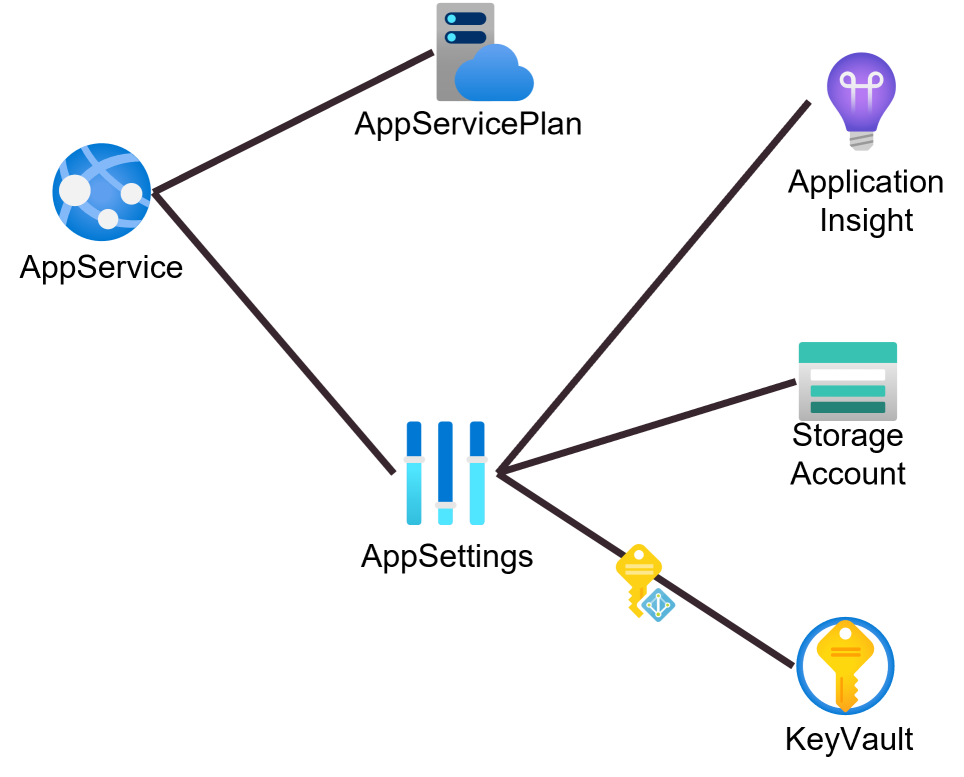

# Bicep vs Terraform

This repo is the repository for the demos of the session "Bicep vs Terraform: la battaglia dell'IaC su Azure!" for DevOpsHeroes Parma 2022 event.

## Demo
The demo shows how you can create a simple environment in both tools.
The environment is the following:

* The AppService has the connection string of the storage in its AppSettings.
* The connection string is a reference to a secret in a KeyVault service
* the AppService accesses to the KeyVault with a Managed Instance
* The replication of the Storage Account depends on the environment (LRS for Dev environment, GRS for Prod environment)
* The SKU of the AppServicePlan depends on the environment (F1 for Dev environment, S1 for Prod environment)
* The KeyVault must exist before the creation of the others resources and the other resources must use it. The template must check if the KeyVault exists or not.
* The ApplicationInsight must exist only in Prod Envirnoment